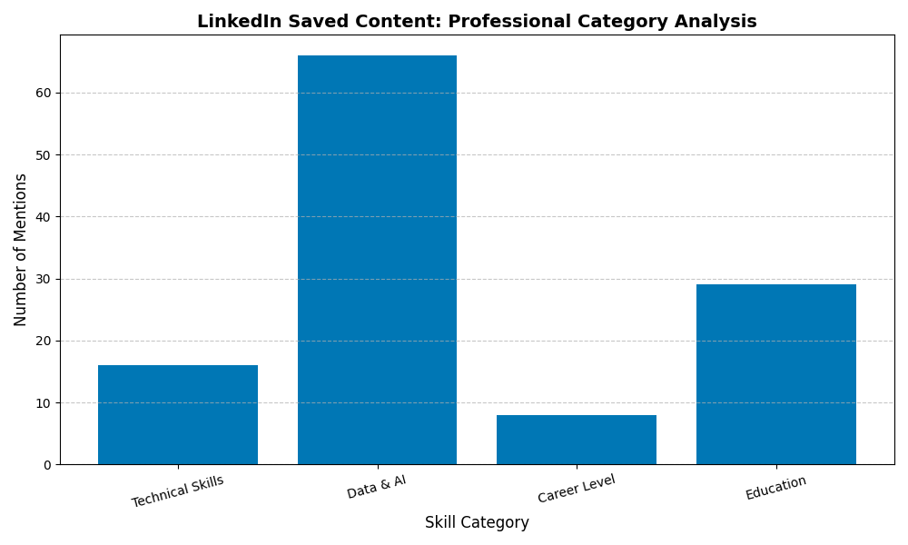

# LinkedIn Content Intelligence
This project uses Python and Regular Expressions to transform unstructured LinkedIn "Saved Items" into a structured dataset for career trend analysis.

__Tech Stack__: Python, Pandas, Regex.

## 📊 Strategic Insights
By cross-referencing skill categories with sentiment analysis, the project revealed the following distribution:

| Category | Critical | Neutral | Positive |
| :--- | :---: | :---: | :---: |
| Data & AI | 1 | 11 | 14 |
| Technical Skills | 1 | 4 | 7 |
| General/Other | 3 | 24 | 16 |

**Key Observation:** Data & AI content shows the highest engagement in motivational/positive tones, while general content remains largely technical and neutral.